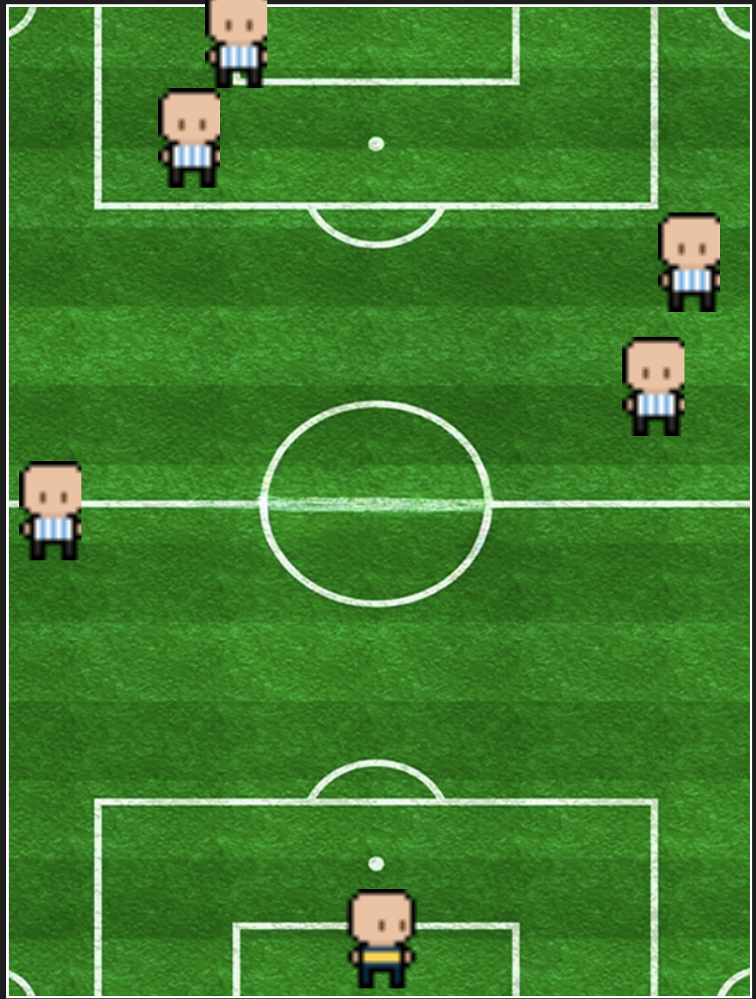
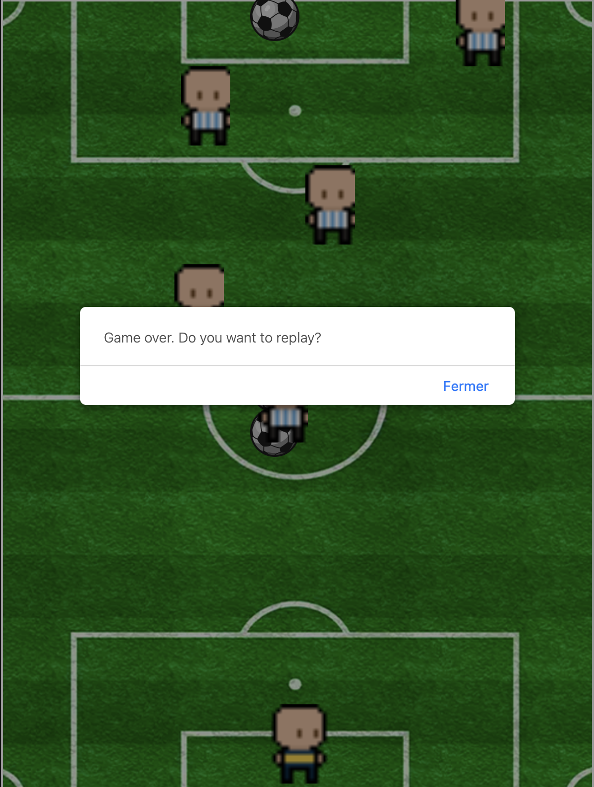

<h1>Football Game</h1>

<div style="display: flex; justify-content: flex-start;">
     
    
     
</div>

</div>

<h2>Description</h2>

The Football Game is an interactive game where the player controls a character that must shoot a ball towards the goal while avoiding obstacles. The objective of the game is to score goals by getting the ball into the goal while avoiding collisions with randomly appearing obstacles on the field.

<h2>Technologies Used</h2>

-  HTML: For the structure of the page.
-  CSS: For styling and layout of the game.
-  JavaScript: For game logic and user interaction.

<h2>Features</h2>

-  Player movement using the arrow keys.
-  Ball shooting with the spacebar.
-  Random obstacle generation on the field.
-  Collision detection between the ball, player, and obstacles.
-  Scoring system that increments when a goal is scored.

<h2>Installation</h2>

1. Clone this repository to your local machine using:
   ```bash
   git clone https://github.com/your-username/football-game.git
   ```

2. Navigate to the project folder:
   ```bash
   cd football-game
   ```

3. Open the `index.html` file in your browser to play the game.

<h2>Usage</h2>

-  Use the arrow keys to move the player up and down.
-  Press the spacebar to shoot the ball towards the goal.
-  Avoid the obstacles that appear on the field.
-  Try to score as many goals as possible to increase your score!

<h2>Live Demo</h2>

[Open Football Game](https://yvannguy.github.io/football-game-deploy/)


<h2>Help</h2>

If you encounter any issues or have questions, feel free to open an issue on this repository.


